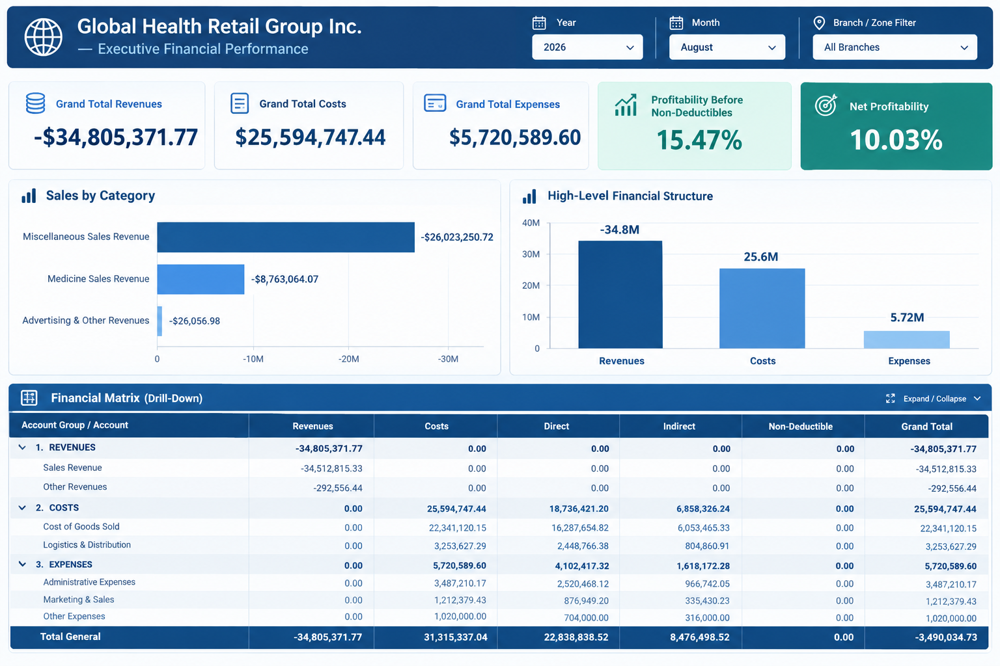

# Global Health Retail Group Inc.
## Executive Project Brochure: AI-Driven Financial & Operational Optimization Platform
*Reporting Baseline: August 2026*

---

## Executive Summary

As the retail and healthcare sectors demand rapid agility and razor-sharp financial control, **Global Health Retail Group Inc.** presents its next-generation data platform. Transitioning from legacy SAP reporting to an advanced Business Intelligence ecosystem, this initiative unifies financial oversight across 14 standardized regional branches.

Designed for the August 2026 business environment and executive decision-makers, this model connects complex corporate accounting with high-performance analytics, delivering total transparency across revenues, costs, and expenses expressed in USD.

---

## 1. Business Vision: Strategic Alignment & Value Creation

From a business perspective, the platform is engineered to align high-level corporate strategy with daily operational execution, ensuring financial governance and deep operational visibility.

*   **Holistic Corporate Visibility:** Consolidates multi-branch ledger activity into a single source of truth, enabling leadership to track overall performance or zoom into specific districts instantly.
*   **Benchmarking & Zonal Weighting:** Accurately manages multi-entity distribution by grouping stores into operational and geographical zones (Zones A, B, and C) backed by precise weighting factors.
*   **Profitability Management:** Tracks core profitability metrics in real time, separating direct costs, indirect overheads, and non-deductible items to protect operating margins.
*   **Executive Self-Service:** Empowers leaders with interactive global filters (Year 2026, Year-to-Date August, and Branch/Zone selection) to evaluate financial health without manual spreadsheet consolidation.

### Zonal Breakdown and Branch Weighting

To optimize management reporting, the 14 branches are grouped and weighted by zone:

| Zone | Branch / Store Name | Weighting (%) |
| :---: | :--- | :---: |
| **Zone A** | North District | 5% |
| **Zone A** | South District | 3% |
| **Zone A** | East District | 2% |
| **Zone A** | West District | 8% |
| **Zone B** | Central Hub | 10% |
| **Zone B** | Metro Branch 1 | 11% |
| **Zone B** | Metro Branch 2 | 6% |
| **Zone B** | Express 01 | 5% |
| **Zone B** | Express 02 | 12% |
| **Zone C** | Airport Store | 3% |
| **Zone C** | Suburban Plaza | 15% |
| **Zone C** | Mall Outlet A | 7% |
| **Zone C** | Mall Outlet B | 9% |
| **Zone C** | Retail Corner | 4% |

---

## 2. Technical Architecture & Data Engineering

From a technical standpoint, the platform implements modern data warehousing principles, ensuring absolute data integrity, query optimization, and seamless integration with BI visualization tools.

### A. Dimensional Storage Layer (Star Schema)
To handle decentralized SAP postings efficiently, the backend is organized into standardized master catalogs and transactional fact tables:
*   **`dim_branch`:** Stores organizational metadata, mapping SAP plant codes (e.g., `NTH-01`) to descriptive names, regions, zonal assignments, and operational statuses (`Active`, `Closed`).
*   **`dim_account`:** Structures the corporate chart of accounts hierarchically across primary groups (*Revenues*, *Costs*, *Expenses*) and cost behaviors (*Direct*, *Indirect*, *Non-Deductible*).
*   **`dim_date`:** Provides rigorous temporal slicing anchored to the August 2026 baseline, covering years, months (`YYYYMM`), and quarters (`Q3`).
*   **`fact_branch_financials`:** Captures disaggregated transactional ledger line items linked via foreign keys to ensure referential integrity.

### B. Consolidated Analytics View (`vw_consolidated_financial_summary`)
A dedicated SQL analytics layer pre-aggregates movements and calculates dynamic window functions to determine proportional shares relative to enterprise grand totals and operational zones, ensuring instant query response times for reporting layers.

### C. BI Semantic Model & DAX Logic (Power BI)

Built upon a strict $1:\ast$ single-direction relationship model, the Power BI semantic engine powers core business logic:

*   **Net Profit / Net Income:** $\text{Total Revenues} - (\text{Total Costs} + \text{Total Expenses})$
*   **Net Profit Margin (%):** $\frac{\text{Net Profit}}{\text{Total Revenues}}$
*   **Branch / Zone Contribution (%):** Dynamically isolates regional and zonal performance against enterprise-wide benchmarks using respective weighting factors.

---

## Conclusion

By merging robust SAP-to-BI architecture with a clear executive business vision and zonal segmentation, the data platform of Global Health Retail Group Inc. establishes a new standard for corporate financial transparency and operational efficiency as of August 2026.

